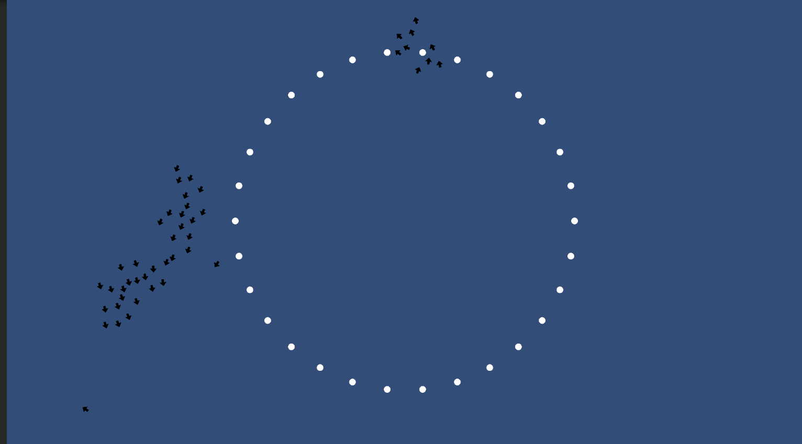

# Boids 2D (Unity)

A 2D implementation of **Boids** by Unity 2020.3.2f1.

**Boids** are an artificial life simulation developed by [Craig Reynolds](http://www.red3d.com/cwr/boids/) in 1986 that models the flocking behavior of birds.

Each boid (an abbreviation of the word "birdoid" which refers to a simulated flocking birds or schooling fish) follows three simple rules from which the flocking behavior you see above emerges.

The three rules are:

- Fly towards the average position of your neighbors (cohesion)
- Match your neighbors' average velocity (alignment)
- Don't get too close to your neighbors (separation)

Here is a simple demo. You can also clone the project and play with the params in UnityEditor.

